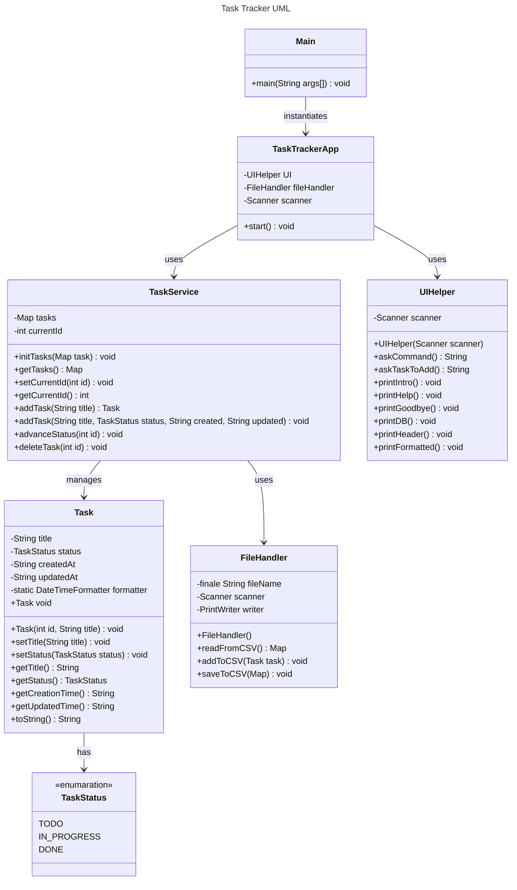

# TaskTracker CLI app made in Java for university

## Project structures

```
task-tracker/
│
├── Main.java
├── app/
│   └── TaskTrackerApp.java   → main loop, CLI logic
│
├── model/
│   └── Task.java             → Task class (fields: id, title, status, etc.)
│   └── TaskStatus.java       → Enum for status (TODO, IN_PROGRESS, DONE)
│
├── service/
│   └── TaskService.java      → Core logic (add/edit/delete/list tasks)
│
├── util/
│   └── UIHelper.java         → Utility for getting validated user input
│   └── FileHandler.java      → Optional: save/load tasks to file
│
└── data/
	└── task-data.txt         → (Optional) persistent storage
```

## UML Structure


